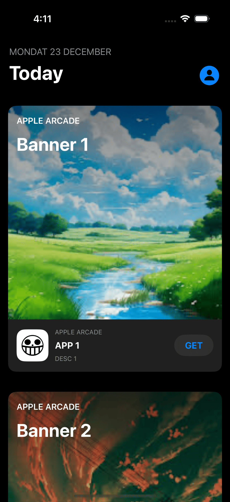
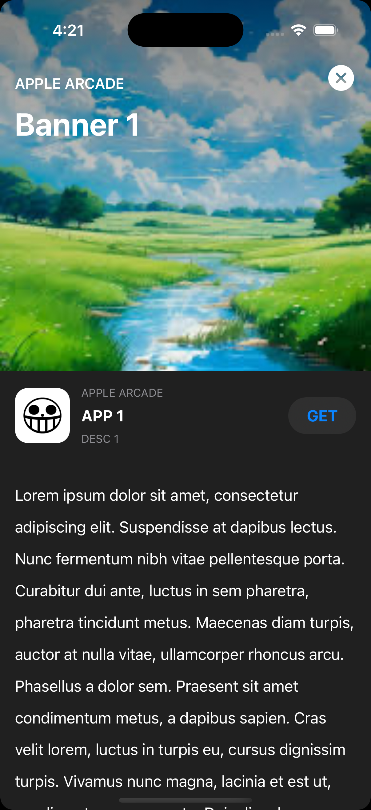

# App Store Hero Animation

A sample Project copying the animation that occurs on banner clicks in App Store in iphones.

## Table of Contents

- [Preview](#preview)
- [Getting Started](#getting-started)
  - [Prerequisites](#prerequisites)
  - [Check it out yourself](#check-it-out-yourself)
- [Acknowledgments](#acknowledgments)

## Preview

  

## Getting Started

Setting up your project and run locally.

### Prerequisites

- `XCode`
- `Swift`
- `SwiftUI`

### Check it out yourself

Step-by-step guide on how to install and set up the project.

1. Clone the repository:
   ```bash
   git clone https://github.com/Aakarsh-verma/AppStoreAnimation.git
   ```
2. Navigate to the project directory open `AppStoreHeroAnimation.xccodeproj` and run the project

## Acknowledgments 
 
- [KavSoft Video Tutorial @YT](https://www.youtube.com/watch?v=AjiLR9ORhzM)
